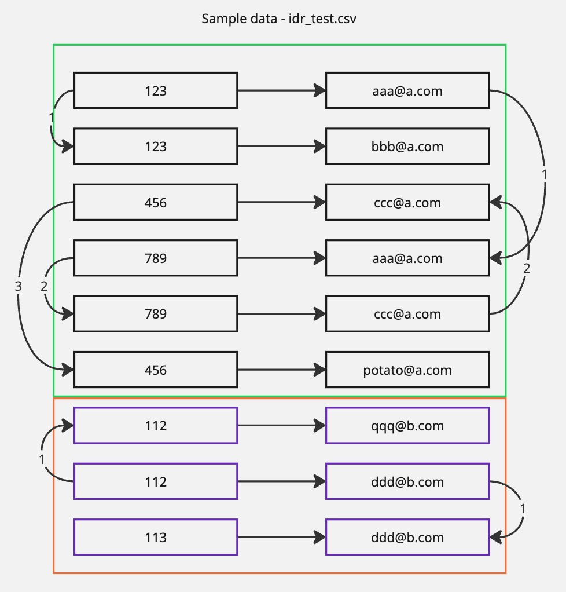
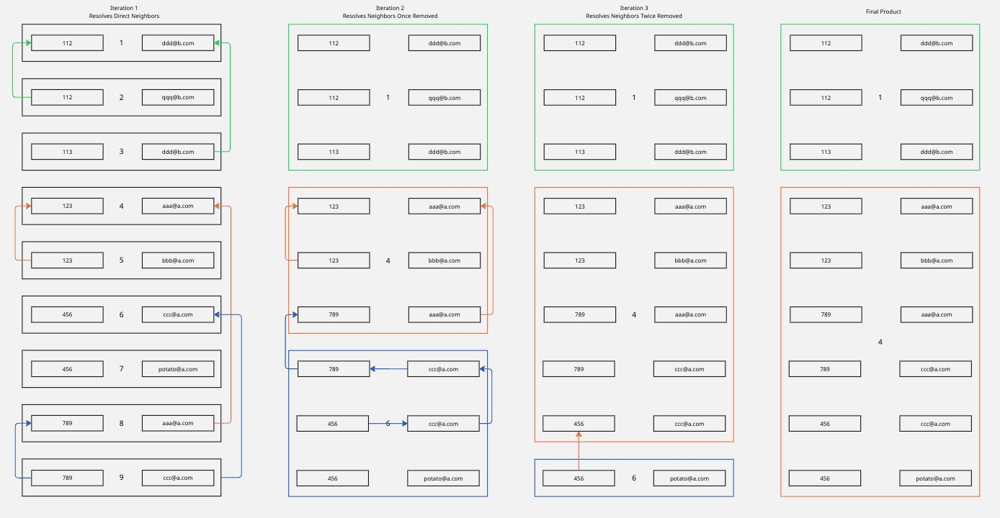
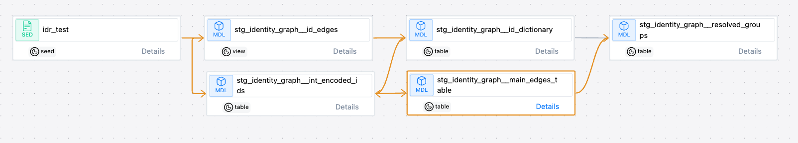

### dbt Identity Graph

This is a proof-of-concept project to create an identity graph in dbt using SQL and jinja. 

The input to the project is a list of known unique user identifiers (e.g., email, user ID, device ID), represented as a table of pairs of identifiers (nodes).

The output is a table that groups together all known identifiers that have touching edges, resolving relationships N layers deep (such as nodes that share a common neighbor, but do not touch directly). The table includes a group ID that represents each connected group of the graph, along with the type and value of each identifier.

### Quickstart


This project is self-contained and will run entirely on your local machine with the dbt-duckdb adapter. Simply spin up a virtual environment, install dependencies, and run dbt. You can then explore the resultant database artifacts with duckcli.

In the event you want to add your own test data, or perhaps try it on some real data, you simply need to edir the file idr_test.csv, and rerun dbt build.

The full command list to run this, assuming you already have python3 installed on your system is:

```
$ python3 -m venv venv
$ source venv/bin/activate
$ pip3 install -r requirements-local.txt
$ source venv/bin/activate
$ dbt build
$ duckcli dbt.duckdb
```

### Why?

This POC represents a common scenario in marketing and web analytics:

- You have multiple platforms that can record data about customer touchpoints.
- Each of these platforms records some, but not all, unique user identifiers. Each platform has its own ID for a user. Each one populates some other unique identifiers, based on hw they were implemented - for example some may also have an email, or the user ID for another platform.
- Some of your platforms have unstable User IDs - this is particularly common with web analytics platforms (GA4/Adobe Analytics) - so you may have one-to-many or many-to-many relationships between identifiers.


Take this example:



This represents two simple ID groups. You can follow the arrows and see that all of these nodes are related, but some of them don't touch the first node.

### How:

1. A list of ID pairs is provided in the idr_test.csv seed. You can edit this seed if you want to add new pairs or actual sample data from your database. 

    Note that there are only two ID types in this but you can have as many as you want - you could add in a third ID like "ecommerce_id" into the mix, and you don't always have to have the same ID type in the same column - you can throw in a row here where node_1 is email, and it will still resolve just fine.

    |timestamp|node_1|type_1|node_2|type_2|edge_source|group|
    |-|-|-|-|-|-|-|
    2024-11-20 3:44:03|123|customer_id|aaa@a.com|email|test_data|group_1
    2024-12-20 3:44:32|123|customer_id|bbb@a.com|email|test_data|group_1
    2025-01-20 3:44:40|456|customer_id|ccc@a.com|email|test_data|group_1
    2024-10-26 2:32:30|789|customer_id|aaa@a.com|email|test_data|group_1
    2024-10-26 3:20:32|789|customer_id|ccc@a.com|email|test_data|group_1
    2024-10-26 3:32:01|112|customer_id|qqq@b.com|email|test_data|group_2
    2024-10-26 2:01:10|112|customer_id|ddd@b.com|email|test_data|group_2
    2024-10-26 2:13:08|113|customer_id|ddd@b.com|email|test_data|group_2
    2024-10-26 2:14:09|456|customer_id|potato@a.com|email|test_data|group_1

    node_1/node_2 represent actual identifiers like IDs or emails, and type_1/type_2 are a string that represents the type of identifier.

    timestamp is irrelevant to matching, but in actual data, would represent the time of the touchpoint where the id pair was observed, for observability purposes.

    edge_source is similarly irrelevant to matching, but in actual data, would allow for the creation of an audit trail along with timestamp.

    All columns are required, except for the group column - this is merely there to show that the matching logic works and groups the nodes as expected.

2. IDs are encoded as integers, and a lookup dictionary is created to map the integers to actual IDs.

3. Main ID resolution (edges) table is created. After this table is created, post-hooks do the following:

    - Swap the edges (this reduces iterations needed in comple ID graphs)
    - Calculate a count of how many edges each node has
    - Generate statistics on average edge count, so outliers can be thrown out if desired (this prevents wasting compute cycles to resolve anomalous groups, such as users being identified with a 'NULL' or 'Unknown' ID)
    - Groups are assigned a group number, which is simply a row number.
    - Groups are resolved by evaluating each row, and looking for the minimum group number associated with an identifier. That minimum becomes the new group ID for the row. This process is repeated until an iteration where no groups are updated.

    Here's what that looks like with the sample data:

    

4. Main edges table is used to create a table of resolved groups.

    You can see the dbt lineage here - note that this doesn't include actions taken by the post-hook macros on stg_identity_graph__main_edges_table, but those are all documented in the macros/ folder.

    

### Variables

You can edit two variables in the dbt_project.yml or pass them via the cli:

- z_score_threshold: Throw out anything with an edge count z score higher than this (no matching performed on these nodes)
- window: How many days from today to look into the past when generating the edges table. This is useful if you have years of historical data, and only want to look at a couple months.

### Can I run this with my actual data?

Sure - just edit the idr_test.csv file. See above for details on what's what in there. You could also edit update_main_edges_table_stats.sql to look somewhere else for source data.

### Can I run this in an actual database?

Probably! I have aspirations to turn this into a full-fledged dbt package with multi-adapter support but haven't gotten there yet. This was written for and tested on DuckDB, which is sorta-mostly Postgres compliant. Most of the SQL used is fairly boilerplate, but you'd probably need to edit some database-specific functions and column type casting here and there. A SQL transpiler like sqlglot might be able to do it with minimal user input. Let me know if you try, and how it goes!
